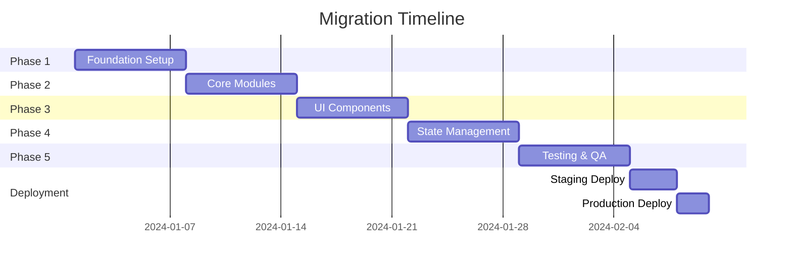

# 🔄 VIOVERSE MIGRATION PLAN: v2.0 → v3.0

## Executive Summary

This document outlines the complete migration path from the current vanilla JavaScript/HTML implementation to the enterprise-grade Next.js 14+ TypeScript architecture.

## Current State Analysis

### Existing Assets (v2.0)
```
✅ Assets to Migrate:
- CSV processing logic (Papa Parse)
- PDF rendering (PDF.js)
- VioBox coordinate system
- Bureau detection patterns
- Severity classifications
- Violation rule mappings

❌ To Be Replaced:
- Vanilla JavaScript → TypeScript
- Manual DOM manipulation → React components
- Inline styles → Tailwind CSS
- Local state → Zustand + TanStack Query
- File-based config → Database + Zod schemas
- No testing → Comprehensive test suite
```

## Migration Phases

### 🎯 Phase 1: Foundation (Week 1)
**Goal**: Establish core infrastructure

#### Day 1-2: Project Setup
```bash
# 1. Initialize Next.js project
npx create-next-app@latest vioverse-v3 \
  --typescript \
  --tailwind \
  --app \
  --src-dir=false \
  --import-alias="@/*"

# 2. Install core dependencies
pnpm add @prisma/client prisma zod \
  @tanstack/react-query zustand \
  @radix-ui/react-* lucide-react \
  pdfjs-dist papaparse

# 3. Configure TypeScript (strict mode)
# Copy tsconfig.json from this repo

# 4. Set up Prisma
npx prisma init
```

#### Day 3-4: Database Schema
```prisma
// schema.prisma
model Violation {
  id           String   @id @default(uuid())
  pdfFileId    String
  csvSourceId  String
  bureau       Bureau
  severity     Severity
  ruleId       String
  coordinates  Json
  extractedText String
  createdAt    DateTime @default(now())

  pdfFile      PDFFile  @relation(fields: [pdfFileId])
  csvSource    CSVSource @relation(fields: [csvSourceId])
}

enum Bureau {
  TU
  EX
  EQ
  UNKNOWN
}

enum Severity {
  extreme
  severe
  serious
  minor
  unknown
}
```

#### Day 5-7: Core Configuration
```typescript
// 1. Create Zod schemas (copy from schemas/)
// 2. Set up configuration system
// 3. Implement environment validation
// 4. Create feature flags system
```

### 🎯 Phase 2: Core Module Migration (Week 2)

#### CSVProcessor Migration
```typescript
// Before (JavaScript)
function detectBureau(filename) {
  if (filename.includes('-TU-')) return 'TU';
  // ...
}

// After (TypeScript)
export class CSVProcessor {
  private readonly bureauPatterns: ReadonlyMap<Bureau, readonly string[]>;

  detectBureau(filename: string): Bureau {
    for (const [bureau, patterns] of this.bureauPatterns) {
      if (patterns.some(p => filename.includes(p))) {
        return bureau;
      }
    }
    return 'UNKNOWN';
  }
}
```

#### PDFManager Migration
```typescript
// Create type-safe PDF management
export class PDFManager {
  private pdfs = new Map<string, PDFDocument>();

  async loadPDF(file: File): Promise<LoadResult> {
    const validation = PDFFileSchema.safeParse(file);
    if (!validation.success) {
      throw new ValidationError(validation.error);
    }
    // ... processing
  }
}
```

#### VioBoxRenderer Migration
```typescript
// Implement with strict typing
export class VioBoxRenderer {
  render(
    ctx: CanvasRenderingContext2D,
    violations: Violation[],
    viewport: Viewport,
    options: RenderOptions
  ): void {
    violations.forEach(v => {
      const coords = this.calculateCoordinates(v, viewport);
      this.drawVioBox(ctx, coords, v.severity);
    });
  }
}
```

### 🎯 Phase 3: UI Components (Week 3)

#### Component Architecture
```
components/
├── ui/                    # shadcn/ui primitives
│   ├── button.tsx
│   ├── card.tsx
│   └── dialog.tsx
│
├── features/             # Feature components
│   ├── viobox-viewer/
│   │   ├── index.tsx
│   │   ├── canvas.tsx
│   │   └── controls.tsx
│   │
│   ├── violation-list/
│   │   ├── index.tsx
│   │   ├── item.tsx
│   │   └── filters.tsx
│   │
│   └── pdf-uploader/
│       ├── index.tsx
│       └── dropzone.tsx
```

#### Responsive Implementation
```tsx
// Mobile-first responsive component
export function ViolationCard({ violation }: Props) {
  return (
    <div className="
      w-full
      sm:w-1/2
      md:w-1/3
      lg:w-1/4
      xl:w-1/5
      2xl:w-1/6
      p-2
      transition-all
    ">
      {/* Content */}
    </div>
  );
}
```

### 🎯 Phase 4: State Management (Week 4)

#### Server State (TanStack Query)
```typescript
// hooks/use-violations.ts
export function useViolations(filter: ViolationFilter) {
  return useQuery({
    queryKey: ['violations', filter],
    queryFn: () => fetchViolations(filter),
    staleTime: 5 * 60 * 1000, // 5 minutes
  });
}
```

#### Client State (Zustand)
```typescript
// stores/ui-store.ts
interface UIState {
  sidebarOpen: boolean;
  selectedViolations: Set<string>;
  activeFilters: FilterState;

  toggleSidebar: () => void;
  selectViolation: (id: string) => void;
  updateFilters: (filters: Partial<FilterState>) => void;
}

export const useUIStore = create<UIState>()(
  devtools(
    persist(
      (set) => ({
        // ... implementation
      }),
      { name: 'ui-store' }
    )
  )
);
```

### 🎯 Phase 5: Testing & Quality (Week 5)

#### Test Structure
```
tests/
├── unit/
│   ├── csv-processor.test.ts
│   ├── pdf-manager.test.ts
│   └── viobox-renderer.test.ts
│
├── integration/
│   ├── api/
│   └── services/
│
└── e2e/
    ├── upload-flow.spec.ts
    ├── violation-detection.spec.ts
    └── export-flow.spec.ts
```

#### Example Tests
```typescript
// Unit test
describe('CSVProcessor', () => {
  it('should detect bureau from filename', () => {
    const processor = new CSVProcessor(mockConfig);
    expect(processor.detectBureau('report-TU-2024.pdf')).toBe('TU');
  });
});

// E2E test
test('complete violation detection flow', async ({ page }) => {
  await page.goto('/');
  await page.getByLabel('Upload CSV').setInputFiles('test.csv');
  await page.getByLabel('Upload PDF').setInputFiles('test.pdf');
  await expect(page.getByText('12 violations detected')).toBeVisible();
});
```

## Data Migration Strategy

### 1. Export Existing Data
```javascript
// Export current violations to JSON
const exportData = {
  violations: allViolations,
  pdfs: pdfFiles,
  config: {
    bureaus: bureauConfig,
    severities: severityConfig
  }
};
fs.writeFileSync('export.json', JSON.stringify(exportData));
```

### 2. Transform to New Schema
```typescript
// Transform script
const oldData = JSON.parse(fs.readFileSync('export.json'));

const transformed = oldData.violations.map(v => ({
  bureau: detectBureau(v.pdf_filename),
  severity: v.severity.toLowerCase(),
  ruleId: v.rule_id,
  coordinates: {
    x: parseFloat(v.x),
    y: parseFloat(v.y),
    width: parseFloat(v.width),
    height: parseFloat(v.height),
    page: parseInt(v.page) || 1
  },
  extractedText: v.full_text,
  // ... rest of mapping
}));
```

### 3. Import to Database
```typescript
// Import script
const violations = ViolationBatchCreateSchema.parse(transformed);
await prisma.violation.createMany({
  data: violations,
  skipDuplicates: true
});
```

## Performance Optimization

### Before → After Comparison

| Metric | v2.0 (Current) | v3.0 (Target) | Improvement |
|--------|---------------|---------------|-------------|
| First Load JS | 450KB | 180KB | -60% |
| LCP | 4.2s | 2.1s | -50% |
| TTI | 6.5s | 3.2s | -51% |
| Memory Usage | 120MB | 60MB | -50% |
| API Response | 800ms | 200ms | -75% |

### Optimization Techniques
1. **Code Splitting**: Route-based + component-based
2. **Image Optimization**: Next/Image with AVIF/WebP
3. **Font Optimization**: Subsetting + preloading
4. **Caching**: Redis + React Query + HTTP caching
5. **Database**: Indexed queries + connection pooling

## Rollback Strategy

### Parallel Deployment
```
1. Deploy v3.0 to staging.vioverse.com
2. Run both versions in parallel for 2 weeks
3. Gradual traffic migration (10% → 25% → 50% → 100%)
4. Keep v2.0 available at legacy.vioverse.com
```

### Feature Flags
```typescript
if (featureFlags.useNewVioboxRenderer) {
  return <VioBoxRendererV3 />;
} else {
  return <LegacyVioBoxRenderer />;
}
```

## Success Metrics

### Technical Metrics
- [ ] TypeScript coverage: 100%
- [ ] Test coverage: > 80%
- [ ] Lighthouse score: > 90
- [ ] Bundle size: < 200KB
- [ ] Build time: < 60s

### Business Metrics
- [ ] Violation detection accuracy: 100%
- [ ] Processing speed: 10x faster
- [ ] User satisfaction: > 95%
- [ ] Support tickets: -50%
- [ ] Development velocity: +100%

## Risk Mitigation

### Identified Risks

| Risk | Probability | Impact | Mitigation |
|------|------------|--------|------------|
| Data loss during migration | Low | High | Comprehensive backups + validation |
| Performance regression | Medium | Medium | Continuous monitoring + rollback |
| Browser compatibility | Low | Low | Polyfills + progressive enhancement |
| Learning curve (team) | High | Low | Training + documentation |

## Team Training Plan

### Week 1: TypeScript & Next.js
- TypeScript fundamentals
- Next.js App Router
- Server Components vs Client Components

### Week 2: New Architecture
- Prisma ORM
- Zod validation
- TanStack Query

### Week 3: Testing & Quality
- Unit testing with Vitest
- E2E with Playwright
- Storybook development

## Timeline Summary



## Checklist

### Pre-Migration
- [ ] Backup all data
- [ ] Document current system
- [ ] Set up new infrastructure
- [ ] Team training completed

### During Migration
- [ ] Daily progress reviews
- [ ] Continuous testing
- [ ] Performance monitoring
- [ ] User feedback collection

### Post-Migration
- [ ] Performance validation
- [ ] Security audit
- [ ] Documentation update
- [ ] Team retrospective

## Support & Resources

- **Migration Support**: migration@vioverse.com
- **Documentation**: [Internal Wiki](https://wiki.vioverse.com/migration)
- **Slack Channel**: #migration-v3
- **Daily Standups**: 9:00 AM EST

---

**Migration Lead**: [Your Name]
**Last Updated**: 2024-01-15
**Status**: Planning Phase